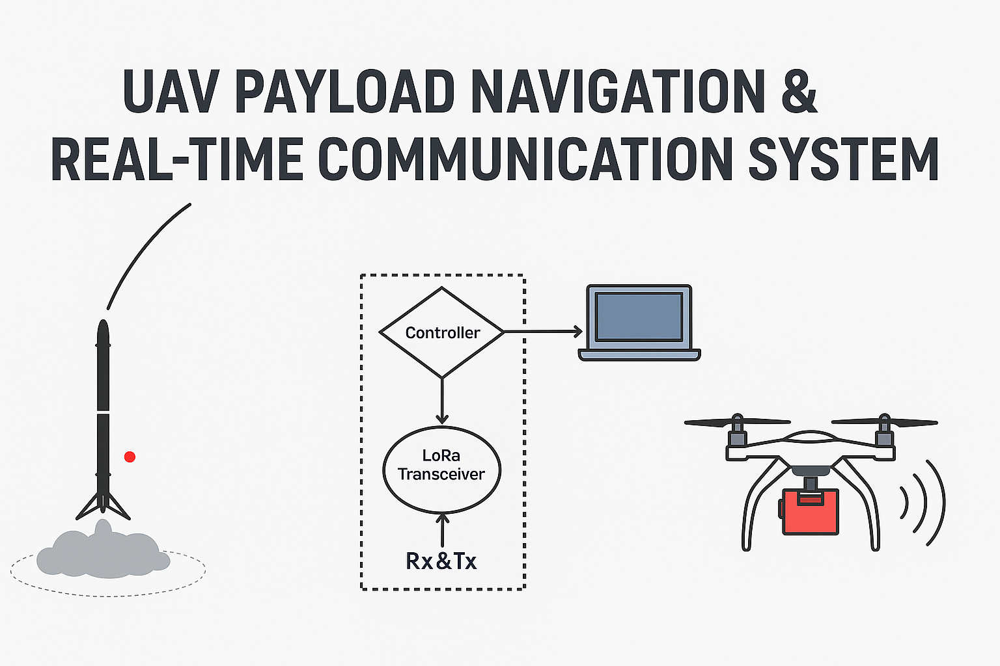
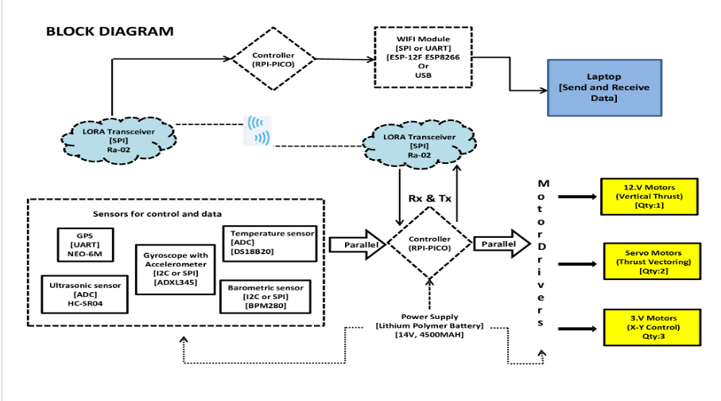
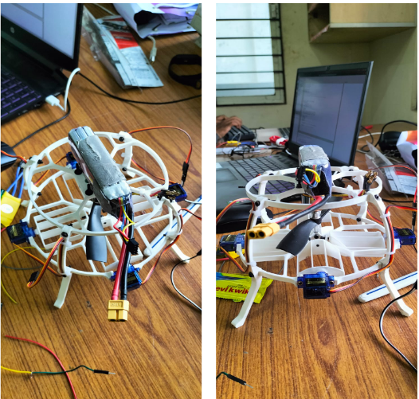

# 🚀 UAV Payload Navigation & Real-Time Communication System

A project focused on developing a reusable UAV system capable of autonomous vertical take-off and landing (VTOL), 3D navigation, and real-time communication — inspired by Falcon 9's reusable launch system.

## Project Overview

Inspired by Falcon 9's pioneering work in reusable rocket technology, this project explores the development of a scaled-down unmanned aerial vehicle (UAV) that mimics fundamental principles such as vertical take-off, autonomous 3D navigation, and precision landing. Designed for terrestrial, controlled conditions, this UAV operates autonomously using real-time sensor feedback and robust communication links without human intervention.

## Key Features

- **Autonomous VTOL**: Vertical Take-Off and Landing without pilot control.
- **3D Navigation**: Navigate to specific coordinates using PID-based control.
- **Real-Time Communication**: Two-way data exchange with a ground station via LoRa.
- **Electric Propulsion**: Environmentally friendly, reusable electric motors.
- **Ground Control Station**: Telemetry and command updates in real-time.

## Technology Stack

- **Programming**: C++
- **Microcontrollers**: RPI-PICO
- **Sensors**: IMU, GPS, Ultrasonic, Temperature, Barometric
- **Communication**: LoRa Modules
- **Control Algorithms**: PID Control
- **Power System**: Lithium Polymer Battery (14V, 4500mAh)

## System Block Diagram

## UAV Prototype Output

## Detailed Description

The pursuit of reusable launch systems has transformed the economics of spaceflight. Inspired by organizations like SpaceX with their groundbreaking Falcon 9 program, vertical takeoff and vertical landing (VTVL) systems have transitioned from ambitious dreams to operational reality.

> **Objective**:  
Develop a reusable UAV system capable of autonomous vertical take-off and landing (VTOL), 3D navigation, and real-time communication, replacing traditional fuel with electric propulsion and controlled through software-based commands without manual intervention.

---

**Roles and Responsibilities:**
- Served as a developer and project coordinator in a 3-member team.
- Led the design and implementation of a control algorithm for autonomous UAV VTOL.
- Developed PID-based auto-navigation logic using real-time sensor feedback for stable 3D flight.
- Built a real-time communication system using LoRa modules for two-way data transfer.
- Replaced traditional fuel systems with electric propulsion units for enhanced reusability.
- Engineered a microcontroller-based ground interface for telemetry tracking and remote debugging.

**Tools & Technologies**: C++, Microcontrollers, IMU/GPS Sensors, LoRa Communication Modules

---

## Academic Acknowledgements

This project was developed independently as part of a personal initiative to replicate advanced aerospace navigation systems for academic exploration.

## License

This project is for educational purposes only and is not available for commercial use without permission.

## Acknowledgements

- SpaceX for inspiration from Falcon 9's reusable systems.
- Open-source libraries and community contributions to embedded systems and control algorithms.
